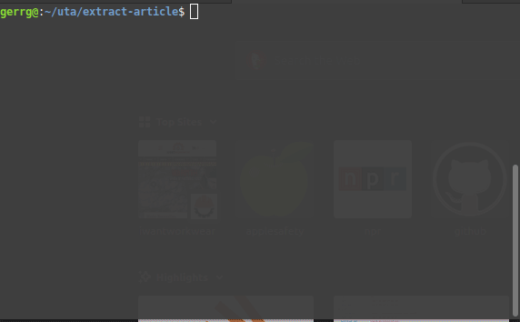

# Extract Articles



Designed to extract artciles from UT Research Division

## Usage

1. Clone the project
2. `npm install` to install dependancies
3. `npm start` runs the application and converts to all articles to .md files

## How I did it

I wrote this simple app to scrape articles from research.utexas.edu.

### Get links with googler

I could not find a public API for the articles

So first I used `$ googler site:yousitehere.com --json >> results.json` to do a site search of the target and save output to .json file.

### Scrape content

After extracting the urls to an array, we pass each url through `buildMarkdownFromUrl`.

First we create a slug from the url

```
// save slug for article file name
const slug = url.split("/").pop();
```

Next we use axios to get all the html from the url

```
// get the data
const { data } = await axios.get(`${url}`);
```

Next grab and extract content with cheerio

```
const $ = cheerio.load(data);

// extract the school, title and date for frontmatter
const school = $("#content p.school").text();
const title = $("#content h1").text().replace(":", "|");
const date = $("#content div.publish_date p")
      .text()
      .replace("Published", "");

// format the published date to yyyy-MM-dd
const formattedDate = formatDate(date);

// get article content
const article = $("article").html();
```

### Create frontmatter

We will want to create a frontmatter (block of key-value pairs) for title, school and date

```
// create frontmatter
const frontmatter =
"--- \ntitle: " +
title +
"\ndate: " +
formattedDate +
"\ncategory: " +
school +
"\n---";

```

### Convert to markdown

Almost done - Use turndown to convert the articles html to a .md file

```
// convert html to markdark
const markdown = frontmatter + "\n\n" + turndownService.turndown(article);
```

Finally write the newly create markdown files to the ./markdown directory

```
const writeTo = `./markdown/${slug}.md`;
fs.writeFileSync(writeTo, markdown);
```
